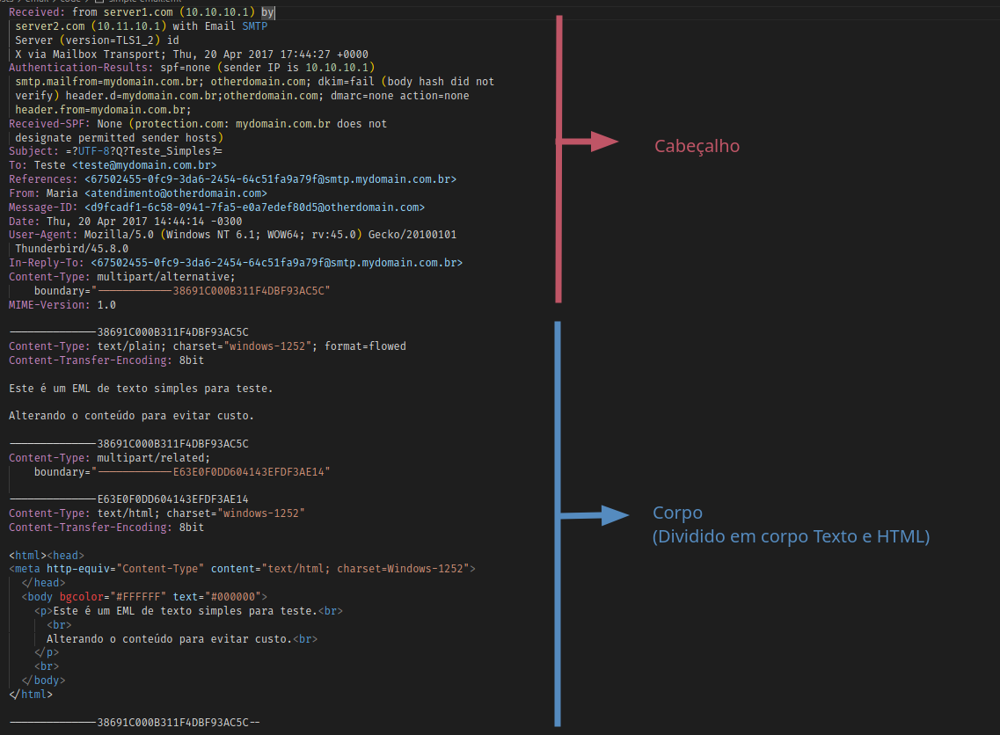
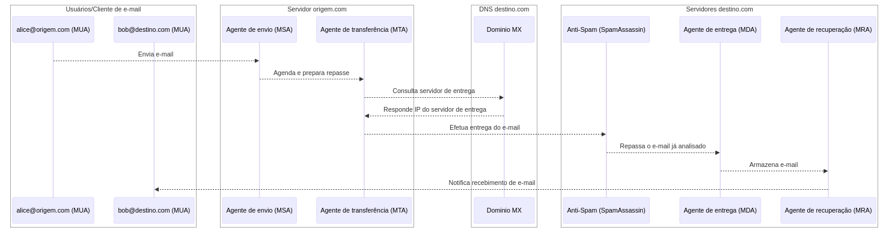
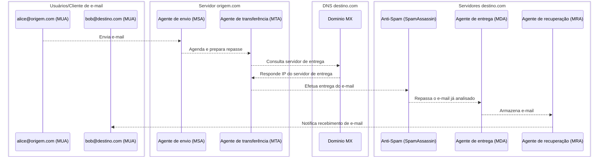
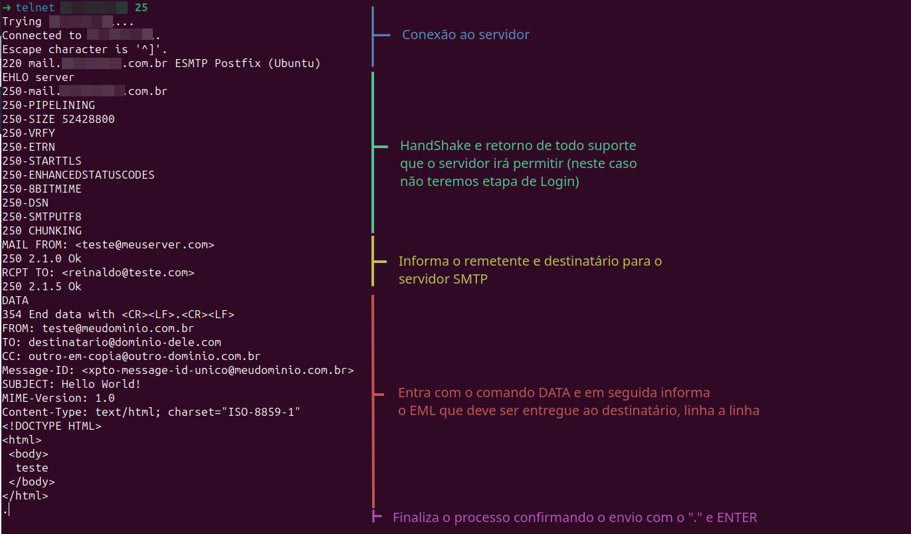

Neste artigo vou compartilhar tudo que sei a respeito de e-mails, iniciando por uma visão geral do que é, como funciona a troca de e-mails, sua estrutura e o que mais eu conseguir organizar.

Este artigo **não será um tutorial** que explica como configurar, instalar ou usar qualquer técnologia relacionada a e-mail, mas sim uma visão geral de como funciona.

## Glossário

1. Introdução
   1. [O que é e-mail](#o-que-é-e-mail)
   2. [Palavras chaves ao se falar de e-mails](#palavras-chaves-ao-se-falar-de-e-mails)
2. Entendendo
   1. [Como é um e-mail](#Como-é-um-e-mail)
   2. [Como funciona a troca de e-mail](#Como-funciona-a-troca-de-e-mail)
   3. [O que são e onde entram servidores de Anti-spam](#O-que-são-e-onde-entram-servidores-de-Anti-spam)
3. Mão na massa
   1. [Usando Telnet para enviar um e-mail na unha](#Usando-Telnet-para-enviar-um-e-mail-na-unha)
4. Conclusão
   1. [Referências](#Referências)

## O que é e-mail

Um e-mail como o próprio nome diz é uma forma eletônica de "trocar cartas", ou seja, uma forma de comunicação "formal" entre as pessoas utilizando um computador.

Para um e-mail funcionar, basta que exista ao menos um servidor de e-mail (que contenha os endereços de e-mail) que possa ser acessado por pessoas conectadas numa rede de computadores (Local ou Internet), e que essas pessoas utilizem um programa como cliente de e-mail (que pode ser um programa de terminal, gráfico ou um site - conhecidos normalmente por webmail-).

Alguns exemplos de clientes de e-mail são:

- De terminal:
  - [Mutt](http://www.mutt.org/)
  - [Alpine](https://alpineapp.email/)
- Gráficos:
  - [Thunderbird](https://www.thunderbird.net/pt-BR/)
  - [Outlook](https://www.microsoft.com/pt-br/microsoft-365/outlook/email-and-calendar-software-microsoft-outlook)
- Webmail:
  - [enContact](https://www.encontact.com.br/)
  - [Gmail](https://mail.google.com/)
  - [Outlook Web](https://outlook.live.com/owa/)

## Palavras chaves ao se falar de e-mails

Ao falarmos de e-mail parece ser simples e direto - escrevo o e-mail, envio e ele é recebido pelo destinatário - porém se começarmos a estudar seu funcionamento, vamos nos deparar com uma série de termos que são utilizados em sua configuração e infra-estrutura, e que se não forem explicados, farão falta para entender todo o seu funcionamento.

Neste tópico, vou explicar esses termos e seus significados, e tentar deixar o mais claro possível o que cada um deles representa, para depois podermos junta-los e entender como cada um executa seu papel no todo.

Iremos apresentar agora:

- [EML](#eml)
- [SMTP](#smtp)
- [POP3](#pop3)
- [IMAP](#imap)
- [MX](#mx)
- [SPF](#spf)
- [DKIM](#dkim)
- [DMARC](#dmarc)

### EML

A extensão de arquivo `.eml` é utilizada para representar um arquivo de e-mail - ou seja, um arquivo que contém dentro dele a estrutura de um e-mail -, e apesar de ser a estrutura "padrão" e mais comum, não é a única estrutura de e-mail existente, podendo ser encontradas outras extensões de arquivos que representam e-mails.

Algumas outras que você pode encontrar são:

- emlx - Utilizada pela [Apple Mail](https://en.wikipedia.org/wiki/Apple_Mail)
- msg - Utilizada pelo [Microsoft Outlook](https://en.wikipedia.org/wiki/Microsoft_Outlook)
- mbox/mbx - Utilizada pelo [Mozilla Thunderbird](https://en.wikipedia.org/wiki/Mozilla_Thunderbird), [Opera Mail](https://en.wikipedia.org/wiki/Opera_Mail), [Eudora](<https://en.wikipedia.org/wiki/Eudora_(email_client)>) e [KMail](https://en.wikipedia.org/wiki/KMail)

E apesar de todas estas outras estruturas que representam e-mails, praticamente todos os clientes conseguem importar e exportar para o formato `.eml`, sendo assim, o formato mais utilizado para troca de e-mails entre clientes.

O formato básico de uma mensagem de e-mail é definido pelo [RFC 5322](https://tools.ietf.org/html/rfc5322), e _é composto por duas partes: o cabeçalho e o corpo_. (A RFC-5322 substituiu a RFC-2822 em 2008, que por sua vez substituiu a RFC-822 em 2001 - que foi o padrão de e-mail por décadas, e havia sido publicada em 1982 baseada na RFC-733 para a ARPANET -).

Vamos falar mais sobre a estrutura do EML no tópico [Como é um e-mail](#Como-é-um-e-mail).

### SMTP

[SMTP](https://en.wikipedia.org/wiki/Simple_Mail_Transfer_Protocol) é a sigla para `Simple Mail Transfer Protocol`, ou seja, Protocolo Simples de Transferência de E-mail. Que em resumo significa que ele contém as regras necessárias para que um servidor de e-mail consiga se comunicar com outro, podendo enviar e receber e-mails.

Servidores de e-mails e outros agentes de transferência de mensagens utilizam o SMTP para enviar e receber mensagens de e-mail. Clientes de e-mail (nível de usuário) normalmente usam o SMTP apenas para enviar mensagens para um servidor de e-mail para retransmissão (normalmente enviam e-mails na porta 587 ou 465 conforme RFC-8314).

A origem dos SMTP's começou em 1980, construído sobre conceitos implementados na ARPANET desde 1971. Ele foi atualizado, modificado e extendido multiplas vezes. O protocolo em uso comum hoje tem estrutura extensível com várias extensões para autenticação, criptografia, transferência de dados binários e endereços de e-mail internacionalizados. Servidores SMTP comumente utilizam o protocolo TCP na porta 25 (para comunicações em texto plano) e 587 (para comunicações criptografadas).

#### Visão simples do protocolo

SMTP é um protocolo de texto simples, no qual um cliente SMTP fala com um servidor SMTP e o servidor responde. O cliente SMTP envia comandos, e o servidor SMTP responde com códigos de status e respostas de texto. Por exemplo, o cliente SMTP pode enviar o comando `HELO` e o servidor SMTP responderá com um código de status `250` e uma resposta de texto `mail.example.com Hello client.example.com`.

Uma transação SMTP (após a conexão efetuada com o servidor) consiste em três sequências de comandos/respostas:

- Comando **MAIL**, para estabelecer o endereço de retorno (Também referido como return-path, reverse-path, bounce address, mfrom, ou envelope sender). Nele normalmente é informado o endereço de e-mail do remetente.
- Comando **RCPT**, para estabelecer o endereço do destinatário (Também referido como forward-path, envelope recipient, ou envelope to). Nele normalmente é informado o endereço de e-mail do destinatário.
- Comando **DATA** para sinalizar o início do texto da mensagem (No caso o conteúdo de texto EML do e-mail a ser enviado - Consiste em um cabeçalho de mensagem e um corpo de mensagem separados por uma linha vazia -). DATA é na verdade um grupo de comandos, e o servidor responde duas vezes: uma vez para o próprio comando DATA, para reconhecer que está pronto para receber o texto, e a segunda vez após a sequência de fim-de-dados (normalmente uma linha final é indicada por um `.`[ponto final]), para aceitar ou rejeitar a mensagem inteira.

Além disso, o cliente SMTP pode usar o comando **VRFY** para verificar se um nome de usuário ou alias de e-mail é válido, ou o comando **EXPN** para expandir um nome de lista de distribuição.

Ao final do comando **DATA**, cada servidor pode responder com um código que pode ser positivo (2xx), negativo (4xx ou 5xx), ou interromper a conexão (1xx ou 3xx). Além disso, o servidor pode responder com uma mensagem de status de texto opcional, e o cliente SMTP pode responder com um comando **RSET** para reiniciar a transação.

## POP3

[POP3](https://en.wikipedia.org/wiki/Post_Office_Protocol) é a sigla para `Post Office Protocol`, ou seja, Protocolo de Correio Postal. Que em resumo significa que ele contém as regras necessárias para que um cliente de e-mail consiga se comunicar com um servidor de e-mail, podendo baixar e-mails.

O POP3 é um protocolo de aplicação em camadas que permite que um cliente de e-mail recupere mensagens de e-mail de um servidor de e-mail remoto. O POP3 foi projetado para ser compatível com vários formatos de caixa de correio. O POP3 permite que um cliente de e-mail faça o download de todas as mensagens de e-mail de um servidor de e-mail remoto. O POP3 é um protocolo de texto simples que usa o TCP na porta 110. Um cliente de e-mail que usa o POP3 normalmente se conecta ao servidor de e-mail, baixa todas as mensagens de e-mail e as exclui do servidor de e-mail, mas as mensagens de e-mail podem ser baixadas sem serem excluídas ou podem ser mantidas no servidor de e-mail para serem baixadas por outros dispositivos.

O POP3 foi projetado em 1984 (RFC-918) e atualizado em 1988 (RFC-1081) e 1996 (RFC-1939). O POP3 foi substituído pelo IMAP, que oferece mais recursos.

## IMAP

[IMAP](https://en.wikipedia.org/wiki/Internet_Message_Access_Protocol) é a sigla para `Internet Message Access Protocol`, ou seja, Protocolo de Acesso a Mensagens da Internet. Que em resumo significa que ele contém as regras necessárias para que um cliente de e-mail consiga se comunicar com um servidor de e-mail, podendo baixar e-mails.

O IMAP é um protocolo de aplicação em camadas que permite que um cliente de e-mail recupere mensagens de e-mail de um servidor de e-mail remoto. O IMAP foi projetado para ser compatível com vários formatos de caixa de correio. O IMAP permite que um cliente de e-mail faça o download de mensagens de e-mail individuais de um servidor de e-mail remoto. O IMAP é um protocolo de texto simples que usa o TCP na porta 143. Um cliente de e-mail que usa o IMAP normalmente se conecta ao servidor de e-mail, baixa mensagens de e-mail individuais e as exclui do servidor de e-mail, mas as mensagens de e-mail podem ser baixadas sem serem excluídas ou podem ser mantidas no servidor de e-mail para serem baixadas por outros dispositivos.

## MX

[MX](https://en.wikipedia.org/wiki/MX_record) é a sigla para `Mail Exchanger`, que especifica qual é o Servidor de e-mail responsável por aceitar mensagens através de um nome de domínio (@dominio.com por exemplo).

O MX é um registro DNS que aponta um servidor de e-mail para aceitar mensagens para um domínio. Este registro de DNS contém o nome de domínio de um servidor de e-mail e um valor de prioridade, ou seja, ele permite que você tenha uma lista de servidores e ordene-os por prioridade.

O MX é um registro de DNS obrigatório para que um servidor de e-mail possa receber mensagens de e-mail.

O registro de DNS apresenta a seguinte estrutura:

```txt
Dominio         TTL     Classe  Tipo    Prioridade   Host do email
example.com.    1936    IN      MX      10           onemail.example.com.
example.com.    1936    IN      MX      10           twomail.example.com.
```

No caso acima temos dois servidores de e-mail para o domínio `example.com`, e ambos tem a mesma prioridade, ou seja, o servidor de e-mail que for enviar uma mensagem para o domínio `example.com` pode escolher um dos dois servidores para enviar a mensagem.

## SPF

[SPF](https://en.wikipedia.org/wiki/Sender_Policy_Framework) é a sigla para `Sender Policy Framework`, ou seja, "Estrutura de Política do Remetente". Que em resumo significa que ele contém as regras necessárias para que um servidor de e-mail consiga validar se um servidor de e-mail é autorizado a enviar mensagens em nome de um domínio.

O SPF é um registro de DNS consultado quando um e-mail é enviado, ele contém a lista de servidores que podem enviar e-mails em nome daquele domínio, e é consultando esta lista, que o servidor que está recebendo a mensagem verifica se o servidor que está dizendo ser o remetente da mensagem é realmente autorizado a enviar mensagens em nome do domínio que está informando.

Caso o servidor que está recebendo a mensagem não encontre o registro SPF, ele pode considerar a mensagem como SPAM, pois não tem como saber se o servidor que está enviando a mensagem é realmente autorizado a enviar mensagens em nome do domínio que está informando.

Existem algumas nuances sobre o SPF como por exemplo, ele pode ser configurado para informar que o servidor deve Recusar o recebimento caso o SPF não esteja condizendo com o esperado, ou apenas marcar a mensagem como SPAM, ou ainda, aceitar a mensagem mesmo que o SPF não esteja condizendo com o esperado.

Para mais informações sobre SPF, seguem alguns links de apoio que podem ajudar com detalhes:

Documento oficial do SPF (rfc 7208):
https://datatracker.ietf.org/doc/html/rfc7208

Tabela de Registros de SPF, informando detalhes referentes ao texto preenchido no campo valor:
https://mxtoolbox.com/dmarc/spf/spf-record-tags

## DKIM

[DKIM](https://en.wikipedia.org/wiki/DomainKeys_Identified_Mail) é a sigla para `DomainKeys Identified Mail`, é um método de autenticação de e-mail projetado para detectar endereços de remetente forjados em e-mails (spoofing de e-mail), uma técnica frequentemente usada em phishing e spam de e-mail.

DKIM permite ao recipiente checar se o e-mail foi autorizado pelo proprietário do domínio do remetente. Ele faz isso criptografando o conteúdo do cabeçalho e do corpo do e-mail usando uma chave criptográfica publicada no DNS do domínio do remetente. Um destinatário pode usar uma chave pública publicada no DNS para decodificar o conteúdo criptografado e verificar se ele corresponde ao conteúdo do e-mail.

DKIM é um Internet Standard. Ele foi difinido na [RFC 6376](https://datatracker.ietf.org/doc/html/rfc6376), datado de Setembro de 2011, com atualizações em [RFC 8301](https://datatracker.ietf.org/doc/html/rfc8301) e [RFC 8463](https://datatracker.ietf.org/doc/html/rfc8463).

Exemplo de um cabeçalho DKIM inserido em um e-mail:

```txt
DKIM-Signature: v=1; a=rsa-sha256; d=example.net; s=brisbane;
     c=relaxed/simple; q=dns/txt; i=foo@eng.example.net;
     t=1117574938; x=1118006938; l=200;
     h=from:to:subject:date:keywords:keywords;
     z=From:foo@eng.example.net|To:joe@example.com|
       Subject:demo=20run|Date:July=205,=202005=203:44:08=20PM=20-0700;
     bh=MTIzNDU2Nzg5MDEyMzQ1Njc4OTAxMjM0NTY3ODkwMTI=;
     b=dzdVyOfAKCdLXdJOc9G2q8LoXSlEniSbav+yuU4zGeeruD00lszZ
              VoG4ZHRNiYzR
```

## DMARC

[DMARC](https://en.wikipedia.org/wiki/DMARC) é a sigla para `Domain-based Message Authentication, Reporting and Conformance`, ou seja, Autenticação de Mensagens Baseada em Domínio, Relatórios e Conformidade.

Ele é designado para dar aos proprietários de domínios de e-mail a capacidade de proteger seu domínio contra uso não autorizado, comumente conhecido como spoofing de e-mail. O objetivo e o resultado primário da implementação do DMARC é proteger um domínio contra uso em ataques de comprometimento de e-mail comercial, e-mail de phishing, golpes de e-mail e outras atividades de ameaças cibernéticas.

Uma vez que a entrada de DNS DEMARC é publicada, qualquer servidor de e-mail que receba um e-mail de um domínio protegido pelo DMARC pode verificar a autenticidade do e-mail. Se o e-mail passar na autenticação, ele será entregue na caixa de entrada do destinatário. Se o e-mail falhar na autenticação, ele pode ser entregue na pasta de spam ou rejeitado completamente, dependendo da política de DMARC publicada pelo proprietário do domínio.

DMARC extende dois mecanismos de autenticação de e-mail existentes, Sender Policy Framework (SPF) e DomainKeys Identified Mail (DKIM). Ele permite que o proprietário administrativo de um domínio publique uma política em seus registros DNS para especificar como verificar o campo From: apresentado aos usuários finais; como o receptor deve lidar com falhas - e fornece um mecanismo de relatório para as ações executadas sob essas políticas.

DMARC foi publicado na [RFC 7489](https://datatracker.ietf.org/doc/html/rfc7489) em Março de 2015.

## Como é um e-mail

Um e-mail - em sua estrutura EML - é composto por duas partes: o cabeçalho e o corpo. O cabeçalho é composto por uma série de campos em formato de Chave/Valor, e o corpo é composto por uma série de linhas de texto organizada por algumas regras que o que podem separá-lo em "aquivos" de tipo específicos.

O cabeçalho e o corpo de um e-mail são separados por uma linha vazia.

### Sobre o Cabeçalho

O cabeçalho de um e-mail é composto por uma série de campos em formato de Chave/Valor, onde cada campo é separado por uma quebra de linha, e cada campo é composto por uma chave e um valor separados por dois pontos `:`.
Alguns campos podem ter mais de um valor, e neste caso, os valores são separados por ponto e vírgula `;`.

### Sobre o Corpo

Existem diversas formas de representar a estrutura do corpo de um e-mail, e uma delas é chamada de Multi-part MIME, que é uma estrutura que permite que o corpo de um e-mail seja composto por diversos "arquivos" de tipos diferentes, podendo dar subporte a arquivos de mídia como imagens, vídeos, áudios, etc.

### Mais detalhes

Um exemplo de um EML simples pode ser verificado na figura abaixo, onde se destaca a separação entre o cabeçalho e o corpo do e-mail:

<!--  -->



Todos os detalhes de como se formam a estrutura de um EML podem ser encontrados na [RFC 5322](https://tools.ietf.org/html/rfc5322).

## Como funciona a troca de e-mail

Quando falamos sobre a troca de e-mails e nos referimos as comuninações entre os servidores, estamos falando sobre algumas entidades conceituais que não citamos ainda, são elas:

- MUA - Mail User Agent (Cliente de e-mail)
  - Podem ser clientes de terminal, gráficos ou webmail.
- MSA - Mail Submission Agent (Agente de envio de e-mail)
  - Servidor de e-mail que recebe o pedido de envio do e-mail e prepara na fila de envio (normalmente o mesmo servidor do MTA).
- MTA - Mail Transfer Agent (Agente de transferência de e-mail)
  - Servidor que a partir do e-mail em fila, efetua a tentativa de entrega a cada um dos destinatários.
- MDA - Mail Delivery Agent (Agente de entrega de e-mail)
  - Servidor de e-mail que recebe o e-mail, e pode armazená-lo (junto ao MRA para obtenção via POP/IMAP posterior), ou entregar diretamente ao MUA do destinatário.
- MRA - Mail Retrieval Agent (Agente de recuperação de e-mail)
  - Servidor de e-mail que armazena os e-mails recebidos, e permite que o usuário os recupere via POP/IMAP.

Vamos desenhar uma sequência de troca de e-mails entre dois usuários, para entendermos como funciona a troca de e-mails entre os servidores.

Figura:


Diagrama [MermaidJs](https://mermaid.js.org/):


O processo acima pode se repetir para cada destinatário de e-mail individualmente (principalmente se a entrega é referente a domínios diferentes).

## O que são e onde entram servidores de Anti-spam

Servidores de Anti-spam são servidores de e-mail que tem como objetivo principal efetuar um filtro e agir como um portal (Gateway) de entrada de e-mails, ou seja, eles recebem os e-mails e os encaminham para o servidor de e-mail do destinatário após efetuarem a varredura e análise do conteúdo. Normalmente são referenciados pelo dominio MX, onde recebem o e-mail antes de repassar ao servidor adequado de entrega.

Um antispam não necessáriamente rejeita um e-mail suspeito, essa ação é configurável e pode ser definida pelo administrador do servidor de e-mail, e normalmente é feita através de uma pontuação, onde o e-mail é analisado e recebe uma pontuação, e caso a pontuação seja maior que o valor configurado, o e-mail é rejeitado, caso contrário, ele é aceito.

Existem servidores Antispam que podem ser instalados como um servidor adicional, um dos mais famosos é o [Spam Assassin](https://spamassassin.apache.org/), e existem também serviços de Anti-spam que podem ser contratados, como por exemplo o [Spam Experts](https://www.spamexperts.com/).

## Usando Telnet para enviar um e-mail na unha

Abaixo mostrarei como você pode enviar um e-mail diretamente do seu terminal para um servidor de envio (MSA), simulando o comportamento que um cliente de e-mail faria para enviar um e-mail.

Para esse exemplo vamos precisar de alguns pré-requisitos:

1. Ter o cliente Telnet instalado (Windows ou Linux)
   1.1. Caso vá efetuar conexão num servidor com criptografia, precisa também do programa openssl instalado
2. Ter acesso a um servidor de e-mail que aceite conexões na porta 25 (ou 587 se for necessário logar com usuário e senha)
3. Ter um endereço de e-mail válido para enviar e receber o e-mail de teste

Primeiro, precisamos nos conectar via telnet ao servidor de e-mail

Para um modo simples, sem conexão criptografada, podemos apenas apontar para o servidor e porta para solicitar conexão:

```bash
## Iniciar efetuando a chamada do telnet para o servidor de e-mail e a porta
$ telnet <endereco_servidor> <porta> ## Exemplo: telnet localhost 25
```

Para o caso de conexão criptografada, precisamos informar que queremos iniciar a conexão com o comando `STARTTLS` por exemplo:

```bash
$ openssl s_client -starttls smtp -connect <endereco_servidor>:<porta> -crlf -ign_eof
## Quando for necessário logar STARTTLS
## Exemplo: openssl s_client -starttls smtp -connect localhost:25 -crlf -ign_eof
```

Após conectado no seridor, é necessário efetuar um comando de HandShake para iniciar a comunicação, e o comando mais comum é o `EHLO` ou `HELO`:

```bash
EHLO meuservidor.com
```

Caso o servidor necessite de autenticação (usuário e senha), os mesmos devem ser informados através do comando `AUTH LOGIN`, e em seguida informando o usuário e senha em base64:

```bash
AUTH LOGIN # Informa que irá informar a autenticação
bWV1dXN1YXJpb0BtZXVkb21pbmlvLmNvbQ== ## Login em base64
TWFuZUFjaG91UXVlRXVJYVBhc3NhckFTZW5oYU5laA== ## Senha em base64
```

Existem outros tipos de autenticação que podem ser informados como `AUTH PLAIN` (Para dados em Plain Text) ou `AUTH CRAM-MD5` (Para dados em MD5).

Em seguida, precisamos informar o remetente da mensagem:

```bash
MAIL FROM: <teste@meudominio.com.br> # Informa o remetente. Obrigatório informar < e > para indicar o endereço.
```

Na linha seguinte, informamos o endereço do destinatário (Caso queira enviar para mais de um destinatário, basta repetir o comando `RCPT TO:` para cada um dos destinatários):

```bash
RCPT TO: <destinatario@dominio-dele.com> # Informa o destinatário da mensagem neste servidor.
```

E finalmente para encerrar precisamos enviar o conteúdo do e-mail (no caso o conteúdo do EML), e para isso usamos o comando `DATA`:

```bash
DATA # Ao informar ele deve apresentar um retorno com o código 354
# Todo conteúdo abaixo é a estrutura de um EML normal, e deve ser enviado linha a linha.
FROM: teste@meudominio.com.br
TO: destinatario@dominio-dele.com
CC: outro-em-copia@outro-dominio.com.br
Message-ID: <xpto-message-id-unico@meudominio.com.br>
SUBJECT: Hello World!
MIME-Version: 1.0
Content-Type: text/html; charset="ISO-8859-1"
<!DOCTYPE HTML>
<html>
 <body>
  teste
 </body>
</html>
. ## O ponto é quem efetua a conclusão do processo e dispara o envio.
```

Ao entrar com o comando `DATA` e pressionar `ENTER`, o servidor irá aguardar que você envie todo o conteúudo do e-mail, e só irá considerar que você concluiu quando encontrar uma linha final contendo apenas um `.`, o que indica o final do conteúdo EML a ser enviado.

Caso não queira efetuar todos esses passos na mão, existem servidores onde você pode efetuar o envio de e-mails para testes, como por exemplo o [MxtoolBox](https://mxtoolbox.com/SuperTool.aspx), onde você pode informar o servidor de e-mail e ele executará um teste.

Alguns outros comandos também existem, porém são menos comuns, por exemplo:

```bash
VRFY <usuario> # Verifica se o usuário existe no servidor
EXPN <lista> # Expande uma lista de distribuição
HELP # Exibe a lista de comandos disponíveis
NOOP # Não faz nada, apenas retorna um OK
RSET # Reinicia o processo de envio
QUIT # Encerra a conexão
```

Um exemplo de envio simples efetuado manualmente por telnet seria:

<!--  -->



## Referências

- Explicação Wikipedia
  - [Email](https://en.wikipedia.org/wiki/Email)
  - [SMTP](https://en.wikipedia.org/wiki/Simple_Mail_Transfer_Protocol)
  - [POP3](https://en.wikipedia.org/wiki/Post_Office_Protocol)
  - [IMAP](https://en.wikipedia.org/wiki/Internet_Message_Access_Protocol)
  - [MX](https://en.wikipedia.org/wiki/MX_record)
  - [SPF](https://en.wikipedia.org/wiki/Sender_Policy_Framework)
  - [DKIM](https://en.wikipedia.org/wiki/DomainKeys_Identified_Mail)
  - [DMARC](https://en.wikipedia.org/wiki/DMARC)
- RFCs referentes a e-mail:
  - [RFC 5321](https://tools.ietf.org/html/rfc5321)
  - [RFC 5322](https://tools.ietf.org/html/rfc5322)
  - [RFC 2045](https://tools.ietf.org/html/rfc2045)
  - [RFC 2046](https://tools.ietf.org/html/rfc2046)
  - [RFC 2047](https://tools.ietf.org/html/rfc2047)
  - [RFC 2049](https://tools.ietf.org/html/rfc2049)
  - [RFC 2821](https://tools.ietf.org/html/rfc2821)
  - [RFC 2822](https://tools.ietf.org/html/rfc2822)
  - [RFC 3461](https://tools.ietf.org/html/rfc3461)
  - [RFC 3462](https://tools.ietf.org/html/rfc3462)
  - [RFC 3463](https://tools.ietf.org/html/rfc3463)
  - [RFC 3464](https://tools.ietf.org/html/rfc3464)
  - [RFC 3465](https://tools.ietf.org/html/rfc3465)
  - [RFC 3466](https://tools.ietf.org/html/rfc3466)
  - [RFC 3467](https://tools.ietf.org/html/rfc3467)
  - [RFC 3468](https://tools.ietf.org/html/rfc3468)
  - [RFC 3469](https://tools.ietf.org/html/rfc3469)
  - [RFC 4409](https://tools.ietf.org/html/rfc4409)
- Outros sites e documentos:
  - [Comandos de SMTP](https://mailtrap.io/blog/smtp-commands-and-responses/)
  - [MxtoolBox](https://mxtoolbox.com/SuperTool.aspx) - Site para testes de e-mail
  - [Spam Assassin](https://spamassassin.apache.org/) - Servidor de Anti-spam
